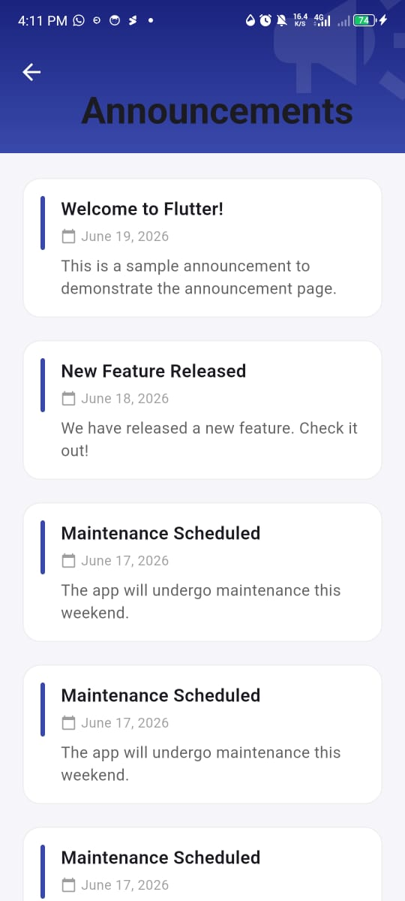

## widget_presentation_flutter

## Demonstration:

This repository demonstrates how to use Slivers and more specifically SliverList.
A sliver is a small portion of a scrollable area. A SliverList is a high performance layout widget that belongs to the Slivers widget family. It is highly customized and helps to render a list of objects.

# Attributes

### 1. `delegate` (SliverChildBuilderDelegate)
The `delegate` property controls how list children are built. Using `SliverChildBuilderDelegate` creates items lazily — only the visible ones are built in memory, which improves performance for long lists. An alternative is `SliverChildListDelegate`, which builds all items upfront.

### 2. `childCount`
A property of `SliverChildBuilderDelegate` that limits how many items the list renders. Without it, the builder keeps creating items indefinitely. Setting `childCount: 20` tells Flutter to stop after 20 items.

### 3. `itemBuilder` / builder callback
The builder function `(context, index) { ... }` is called for each visible item. It receives the current `index` and returns a widget. This is what makes `SliverList` dynamic — each item can be built from data (e.g., `feedAnnouncements[index]`) rather than being hardcoded.

## Screenshots

![Feed Page 2] (screenshots/feed2.jpeg)

## How to Run the Demo

Prerequisities:
- Have flutter and dart SDK installed
- Have an emulator, Chrome similator extension or the phone

- clone the repository
- ``git clone https://github.com/BodeMurairi2/widget_presentation_flutter.git``
-  ``cd widget_presentation_flutter/``
- ``flutter run``

Author: Bode MURAIRI
